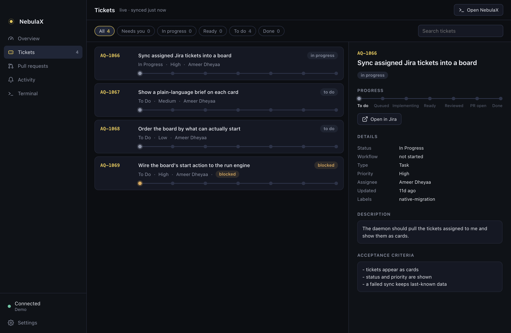

# Glide Deck

A macOS desktop companion for [NebulaX](https://github.com/ameerdhi7/NebulaX). It
shows ticket progress, pull requests, worktrees and notes, raises a notification
for every update, and runs the NebulaX TUI in a built-in terminal.

**Site:** https://site-eight-lovat-80.vercel.app · **Docs:** [`docs/`](docs)



- **Overview**: a done/total progress bar, what's in flight, and what needs you.
- **Tickets**: the daemon's board, filterable. Each ticket sits on a 7-step road
  (To do → Queued → Implementing → Ready → Reviewed → PR open → Done) with its
  brief, evidence, linked PRs and the run's diff. Press play to start an agent on it.
- **Pull requests**: from `gh`, Bitbucket Cloud, or Claude / Codex reading your
  MCP servers. Lists reviews waiting on you, your open PRs and recent merges,
  each linked to the tickets it names.
- **Projects & worktrees**: open or drop projects through the daemon and browse
  every checkout. Optional rotation clears stale worktrees but never removes one
  with uncommitted work.
- **Activity**: every change, kept across restarts. Each one can raise a macOS
  notification with a sound; both are configurable per category.
- **Notes**: notes scoped to a ticket, a project, or general.
- **Working hub & Terminal**: `nebula` running in a real PTY, plus a plain shell.

The app starts its own `nebula web --no-open` bridge on port 7691 (and
`nebula daemon` if none is running). The daemon stays the source of truth.

## Run

Requires Node 22+ (`nvm use`), `nebula` on your PATH, and `gh auth login` for
GitHub PRs.

```sh
npm install      # also rebuilds node-pty for Electron
npm start
npm test
npm run dist     # unsigned dist/mac-arm64/Glide Deck.app  (dist:dmg for a .dmg)
```

## Docs

- [Architecture](docs/architecture.md): how the main process, bridge and renderer fit together
- [Settings](docs/settings.md): PR providers, connections, notifications, rotation
- [Development](docs/development.md): dev isolation, tests, the site

## Repository layout

| Path | What |
|---|---|
| `src/main/` | Electron main process: bridge, PR providers, terminal, notifications |
| `src/renderer/` | The UI (plain JS, no framework) |
| `src/shared/` | Logic shared by both sides (ticket progress, ticket ↔ PR links) |
| `test/` | `node --test` unit tests |
| `docs/` | Project docs |
| `site/` | The landing page and docs viewer, deployed to Vercel |

## License

MIT
